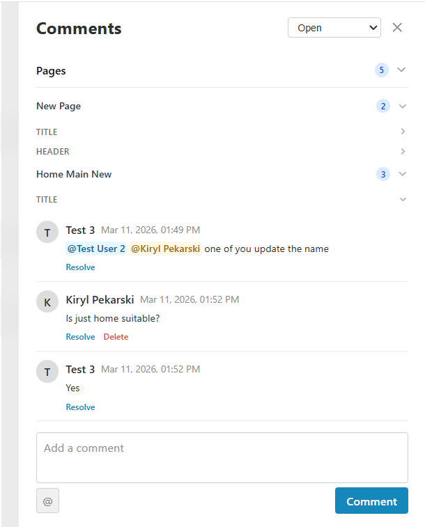
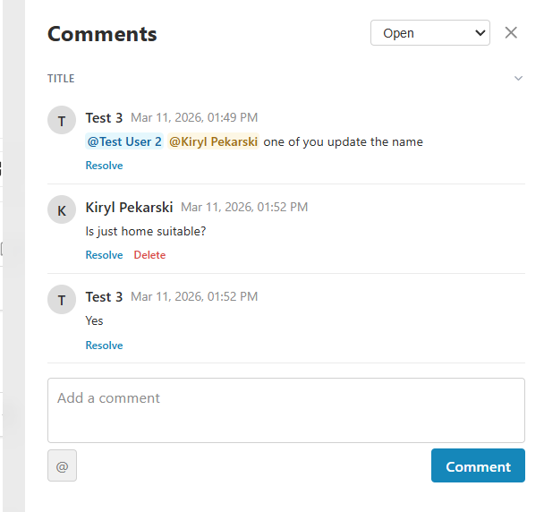
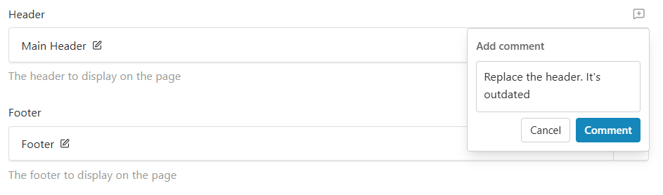
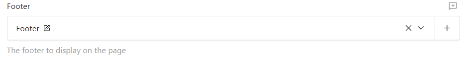
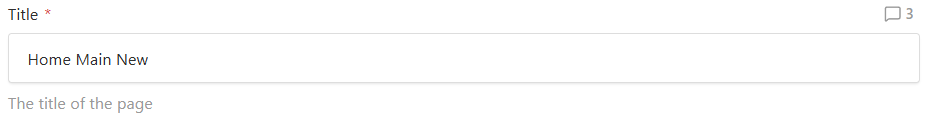

# @focus-reactive/payload-plugin-comments

[](https://www.npmjs.com/package/@focus-reactive/payload-plugin-comments)

A collaborative commenting plugin for [Payload CMS](https://payloadcms.com/) v3. Adds a full-featured comments system to the Payload admin panel — supporting document-level and field-level comments, @mentions with email notifications, comment resolution, multi-tenancy, and locale-aware filtering.

## Table of Contents

- [UI Screenshots](#ui-screenshots)
- [Features](#features)
- [Prerequisites](#prerequisites)
- [Installation](#installation)
- [Setup](#setup)
- [Configuration](#configuration)
- [Translations](#translations)
- [Environment Variables](#environment-variables)
- [Architecture Overview](#architecture-overview)
- [Available Scripts](#available-scripts)
- [Contributing](#contributing)
- [License](#license)

---

## UI Screenshots

### Global Comments Panel

A header button in the Payload admin opens a drawer listing all comments across every document and collection.



### Document Comments Panel

When viewing a document, a side panel shows all comments scoped to that document with filter tabs (Open / Resolved / Mentioned me).



### Field Comment Popup

Clicking the comment badge on a field label opens a popup where you can write and post a new comment for that specific field.



### Field Label Button — Two States

The comment button embedded in the field label has two visual states: no comments (inactive, appears on hover) and one or more open comments (active, showing the count badge).

| Inactive (no comments)                                                             | Active (has comments)                                                          |
| ---------------------------------------------------------------------------------- | ------------------------------------------------------------------------------ |
|  |  |

---

## Features

- **Document-level comments** — Leave comments on any document in any collection
- **Field-level comments** — Comment directly on individual fields; the field label shows a badge with the comment count
- **@mention users** — Mention other users in comments using `@name` autocomplete
- **Email notifications** — Mentioned users receive email notifications via [Resend](https://resend.com/)
- **Resolve comments** — Mark comments as resolved/unresolved; filter by open, resolved, or mentioned
- **Global comments panel** — A header button opens a drawer showing all comments across all documents
- **Optimistic UI** — Comments appear instantly before the server confirms
- **Multi-tenancy** — Scope comments to tenants via `@payloadcms/plugin-multi-tenant`
- **Locale-aware** — Field-level comments are tied to a locale; document-level comments are shown in all locales
- **Auto-cleanup** — Comments are automatically deleted when their parent document is deleted
- **i18n / Translations** — All UI strings are translatable; ship your own locale overrides alongside the built-in English defaults

---

## Prerequisites

- Node.js 20 or higher
- A working [Payload CMS v3](https://payloadcms.com/docs/getting-started/installation) project with Next.js
- pnpm (recommended)
- A [Resend](https://resend.com/) account (required only for mention email notifications)

---

## Installation

```bash
pnpm add @focus-reactive/payload-plugin-comments
```

```bash
npm install @focus-reactive/payload-plugin-comments
# or
yarn add @focus-reactive/payload-plugin-comments
```

---

## Setup

### 1. Add the plugin to your Payload config

```ts
// payload.config.ts
import { buildConfig } from "payload";
import { commentsPlugin } from "@focus-reactive/payload-plugin-comments";

export default buildConfig({
  plugins: [
    commentsPlugin({
      // All collections will get comments. You can specify title field for UI.
      collections: [
        {
          slug: "pages",
          titleField: "title",
        },
      ],
    }),
  ],
  // ... rest of your config
});
```

### 2. Import the styles

Add the plugin's stylesheet to your global CSS or admin layout:

```css
/* global CSS */
@import "@focus-reactive/payload-plugin-comments/styles.css";
```

Or import it in a layout/page file:

```ts
import "@focus-reactive/payload-plugin-comments/styles.css";
```

---

## Configuration

The `commentsPlugin` factory accepts an optional `CommentsPluginConfig` object:

```ts
commentsPlugin(config?: CommentsPluginConfig)
```

### `CommentsPluginConfig`

| Option         | Type                  | Default         | Description                                   |
| -------------- | --------------------- | --------------- | --------------------------------------------- |
| `collections`  | `CollectionEntry[]`   | all collections | Collections whose documents support comments  |
| `enabled`      | `boolean`             | `true`          | Set to `false` to disable the plugin entirely |
| `tenant`       | `TenantPluginConfig`  | —               | Multi-tenancy settings (see below)            |
| `overrides`    | `CollectionOverrides` | —               | Customize the generated `comments` collection |
| `translations` | `Translations`        | —               | Override UI strings per locale (see below)    |

### `CollectionEntry`

Each entry in `collections` can be a plain slug string or an object:

```ts
interface CollectionEntry {
  slug: string;
  titleField?: string; // Field used as document title in the UI. Default: "id"
}
```

**Examples:**

```ts
commentsPlugin({
  collections: [
    { slug: "pages", titleField: "title" }, // Uses "title" field as display name
    { slug: "products", titleField: "name" },
  ],
});
```

### `TenantPluginConfig`

Configure multi-tenancy when using `@payloadcms/plugin-multi-tenant`:

| Option                | Type      | Default     | Description                                                   |
| --------------------- | --------- | ----------- | ------------------------------------------------------------- |
| `enabled`             | `boolean` | `false`     | Enable tenant scoping                                         |
| `collectionSlug`      | `string`  | `"tenants"` | Slug of the tenants collection                                |
| `documentTenantField` | `string`  | `"tenant"`  | Field on document collections that holds the tenant reference |

**Example:**

```ts
commentsPlugin({
  tenant: {
    enabled: true,
    collectionSlug: "tenants",
    documentTenantField: "tenant",
  },
});
```

### Collection Overrides

Use `overrides` to customize the generated `comments` collection — for example, to extend access control or add custom fields:

```ts
commentsPlugin({
  overrides: {
    access: {
      // Override the default "authenticated only" access
    },
    fields: (defaultFields) => [...defaultFields],
    hooks: {
      afterChange: [
        async ({ doc }) => {
          console.log("Comment changed:", doc.id);
        },
      ],
    },
  },
});
```

### Translations

Use `translations` to override any UI string for one or more locales. Each key is a locale code; the value is a partial object of the `CommentsTranslations` shape — keys you omit fall back to the built-in English defaults.

```ts
commentsPlugin({
  translations: {
    fr: {
      label: "Commentaires",
      add: "Ajouter un commentaire",
      writeComment: "Écrire un commentaire",
      comment: "Commenter",
      cancel: "Annuler",
      resolve: "Résoudre",
      reopen: "Rouvrir",
      delete: "Supprimer",
      filterOpen: "Ouverts",
      filterResolved: "Résolus",
      filterMentioned: "Me mentionnent",
    },
  },
});
```

All translatable keys (with their English defaults):

| Key                   | Default (English)              |
| --------------------- | ------------------------------ |
| `label`               | `"Comments"`                   |
| `openComments_one`    | `"{{count}} open comment"`     |
| `openComments_other`  | `"{{count}} open comments"`    |
| `add`                 | `"Add comment"`                |
| `writeComment`        | `"Write a comment"`            |
| `comment`             | `"Comment"`                    |
| `cancel`              | `"Cancel"`                     |
| `posting`             | `"Posting…"`                   |
| `resolve`             | `"Resolve"`                    |
| `reopen`              | `"Reopen"`                     |
| `delete`              | `"Delete"`                     |
| `general`             | `"General"`                    |
| `close`               | `"Close"`                      |
| `syncingComments`     | `"Syncing comments"`           |
| `openCommentsAria`    | `"Open comments"`              |
| `failedToPost`        | `"Failed to post comment"`     |
| `failedToUpdate`      | `"Failed to update comment"`   |
| `failedToDelete`      | `"Failed to delete comment"`   |
| `failedToAdd`         | `"Failed to add comment"`      |
| `unknownAuthor`       | `"Unknown"`                    |
| `noOpenComments`      | `"No open comments"`           |
| `noResolvedComments`  | `"No resolved comments"`       |
| `noMentionedComments` | `"No comments mentioning you"` |
| `filterOpen`          | `"Open"`                       |
| `filterResolved`      | `"Resolved"`                   |
| `filterMentioned`     | `"Mentioned me"`               |

The `Translations` type is exported from the package so you can type your translation objects:

```ts
import type { Translations } from "@focus-reactive/payload-plugin-comments";

const myTranslations: Translations = {
  fr: { label: "Commentaires" },
  de: { label: "Kommentare" },
};

commentsPlugin({ translations: myTranslations });
```

---

## Environment Variables

### Required for email notifications

| Variable            | Description                                    | Example                   |
| ------------------- | ---------------------------------------------- | ------------------------- |
| `RESEND_API_KEY`    | Your Resend API key                            | `re_xxxxxxxxxxxxxxxx`     |
| `RESEND_FROM_EMAIL` | Sender email address for mention notifications | `comments@yourdomain.com` |

If `RESEND_FROM_EMAIL` is not set, mention email notifications are silently skipped and an error is logged to the console.

**.env.local example:**

```env
RESEND_API_KEY=re_xxxxxxxxxxxxxxxx
RESEND_FROM_EMAIL=comments@yourdomain.com
```

---

## Architecture Overview

### How It Works

**Plugin initialization** (`plugin.ts`):

1. The plugin receives a `CommentsPluginConfig` and returns a standard Payload `Plugin` function.
2. It creates a `comments` collection (hidden from the admin sidebar by default).
3. It patches every configured collection to inject `FieldCommentLabel` into each field's admin label — this shows a comment count badge next to each field.
4. It registers two admin providers (`CommentsProviderWrapper`, `GlobalCommentsLoader`) and one admin action (`CommentsHeaderButton`).

**Data loading** (`GlobalCommentsLoader`):

- This server component runs on every admin page load.
- It fetches all comments, document titles, mentionable users, field labels, and collection labels in parallel.
- Results are passed to `GlobalCommentsHydrator` (a client component) which hydrates the `CommentsContext`.

**State management** (`CommentsProvider`):

- Holds `allComments` in React state with optimistic updates via `useOptimistic`.
- `visibleComments` is derived: filtered to the current document/collection/locale based on the Next.js `pathname`.
- Exposes `addComment`, `removeComment`, `resolveComment`, and `syncComments` mutations.

**Field-level comments** (`FieldCommentLabel`):

- The plugin overrides the `Label` component for every named field in every configured collection.
- The label reads comments from context and filters by field path, showing a badge with the count.
- Clicking the badge opens the comments drawer pre-scrolled to that field's comment group.

**Comments collection schema:**

| Field            | Type                    | Description                                            |
| ---------------- | ----------------------- | ------------------------------------------------------ |
| `documentId`     | number                  | ID of the document being commented on                  |
| `collectionSlug` | text                    | Slug of the collection                                 |
| `fieldPath`      | text                    | Dot-notation path of the field (null = document-level) |
| `locale`         | text                    | Locale of the comment (null = shown in all locales)    |
| `text`           | textarea                | Comment body (may contain `@(userId)` mention tokens)  |
| `mentions`       | array → relationship    | Users mentioned in this comment                        |
| `author`         | relationship → users    | Comment author (set automatically)                     |
| `isResolved`     | checkbox                | Whether the comment is resolved                        |
| `resolvedBy`     | relationship → users    | Who resolved it                                        |
| `resolvedAt`     | date                    | When it was resolved                                   |
| `tenant`         | relationship (optional) | Tenant scope (when multi-tenancy is enabled)           |

---

## Available Scripts

Run these from the project root with `pnpm`:

| Command             | Description                                                    |
| ------------------- | -------------------------------------------------------------- |
| `pnpm build`        | Build the plugin to `dist/` (tsup + Tailwind CSS minification) |
| `pnpm dev`          | Build in watch mode — rebuilds on file changes                 |
| `pnpm lint`         | Run ESLint on `src/`                                           |
| `pnpm lint:fix`     | Run ESLint with auto-fix                                       |
| `pnpm format`       | Format `src/` with Prettier                                    |
| `pnpm format:check` | Check formatting without writing                               |

---

## Contributing

1. Fork the repository and create a feature branch.
2. Install dependencies: `pnpm install`
3. Start the build watcher: `pnpm dev`
4. Make your changes in `src/`.
5. Run `pnpm lint` and `pnpm format:check` before submitting.
6. Open a pull request against `main`.

---

## License

MIT © [Focus Reactive](https://focusreactive.com/)
