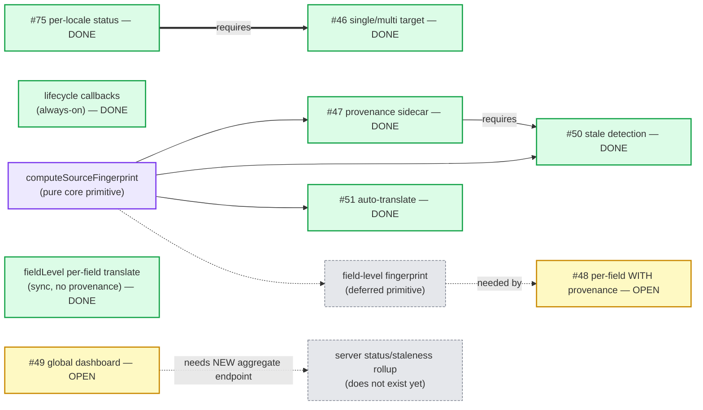
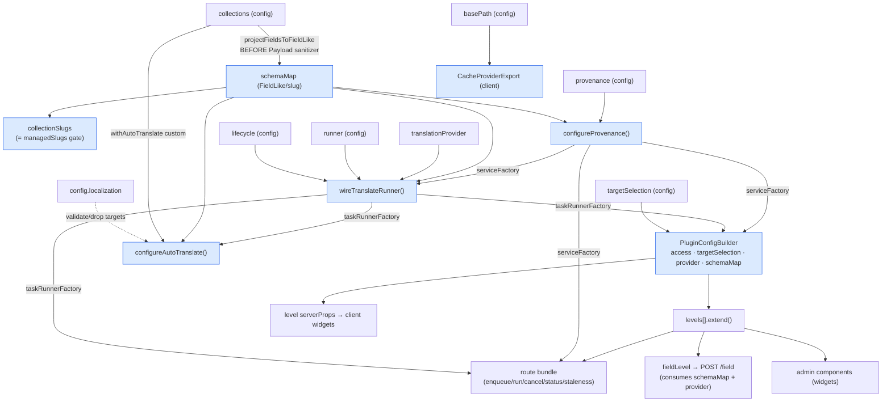

# Translator plugin — feature dependency graph

**Status:** Reference map (Phase 1 — capture only) · **Date:** 2026-07-24 · **Scope:** `@focus-reactive/payload-plugin-translator`
**Provenance:** built + reconciled by an independent architecture-mapping pass (3 read-only agents over config-time wiring, the server feature surface, and the client), cross-checked against a first-pass draft. Edges below carry `file:line` evidence in the code.

Purpose: make the growing web of inter-feature dependencies + cross-feature rules **explicit**, so a
contributor can see — before adding a feature — what depends on what, what each capability produces and
consumes, and which invariants hold across features. Phase 1 is the map; whether to codify any of it into
an init-time mechanism is **deferred** (see §6).

Three layers, kept separate on purpose:
1. **Product / capability graph** — roadmap-level "X unblocks Y" (§1).
2. **Config-time (code) graph** — what `plugin.ts` `init()` actually wires, produces→consumes (§2).
3. **Cross-feature invariants** — rules that span features (§3). Plus the **client graph** (§4) that the
   first draft under-covered.

---

## 1. Product / capability graph (roadmap)

The correction the mapping surfaced: the shared coupling is a **pure fingerprint primitive**
(`computeSourceFingerprint`), NOT the provenance *feature*. #50 and #51 both reuse that primitive;
only #50 additionally needs provenance *enabled*.



`==>` = hard; `-->` solid = hard; `-.->` = soft/shared. Note: `#51` connects to the **primitive**, not
to `#47`.

| Feature | Requires (hard) | Benefits / shares (soft) | Notes |
|---|---|---|---|
| #47 provenance sidecar | — | `computeSourceFingerprint` | Opt-in; SQL needs a consumer migration. |
| lifecycle callbacks | — | — | **Independent, always-on**, ungated (`plugin.ts:141`); not part of #47. |
| #50 stale detection | **#47 enabled** | `computeSourceFingerprint` | Provenance off ⇒ staleness returns `[]`. |
| #51 auto-translate | — (**not** #47) | shares `computeSourceFingerprint` drift-gate | Works with provenance disabled; needs a runner to execute. |
| #46 single/multi target | **#75** (per-locale supersession) | — | Multi fan-out corrupts other locales without per-`(doc,locale)` keying. |
| fieldLevel per-field (shipped) | schemaMap, provider | — | Synchronous `POST {basePath}/field`; **no runner, no persistence, no provenance**. |
| #48 per-field WITH provenance (OPEN) | field-level fingerprint (extends #47) | fieldLevel plumbing | Distinct from shipped fieldLevel: #48 integrates provenance/staleness (see I10). |
| #49 dashboard (OPEN) | **a new server aggregate endpoint** | #47 status, #51 coverage | Cannot reuse per-collection hooks as-is — see §4. |

---

## 2. Config-time (code) graph — what `init()` wires

`plugin.ts` `init()` composes in a **fixed order dictated by produces→consumes edges**.



### Produces / consumes (corrected)

| Producer | Produces | Consumed by | Coupling |
|---|---|---|---|
| `init()` from `collections` (`plugin.ts:128`) | **`schemaMap`** | `ProvenanceService`, the pipeline handler, auto-translate hook, **`fieldLevel` route** (`fieldLevel.ts:33`) | Hard. NOT consumed by the staleness/job routes. |
| `configureProvenance` (`Provenance.wiring.ts:57`) | **`serviceFactory`** (absent when off) | pipeline handler (record), staleness route config (2 handlers share one config) | Soft: absent ⇒ no write, staleness `[]`. **2 consumer sites** (not 3). |
| `wireTranslateRunner` (`wireTranslateRunner.ts:80`) | **`taskRunnerFactory`** + a `configModifier` | auto-translate hook, the 6 job routes | Hard. |
| `configureAutoTranslate` (`plugin.ts:146`) | a `configModifier` (afterChange hook) | `applyTo` | Reads `withAutoTranslate` custom; validates vs `config.localization`. |
| `PluginConfigBuilder` | the config sink | `levels[].extend` | Carries access, `taskRunnerFactory`, `schemaMap`, **`translationProvider`** (→ fieldLevel), `serviceFactory`, `targetSelection`, basePath. |
| `CacheProviderExport(basePath)` | client `basePath` context | all 9 client API hooks | The only always-added admin provider (not deduped). |

### Composition order (and why)
1. **`schemaMap` first** — two reasons: (a) **temporal** — it must snapshot `col.fields` *before* Payload's sanitizer strips `localized` from nested fields (`plugin.ts:122-127`); (b) it's the shared input everything downstream reads.
2. `configureProvenance` before `wireTranslateRunner` (its `serviceFactory` is a runner-wiring input).
3. `wireTranslateRunner` before `configureAutoTranslate` + builder (its `taskRunnerFactory` is their input).
4. builder + `levels[].extend` consume the factories above.
5. `addConfigModifier(runner, provenance, auto)` + `CacheProvider` → `applyTo` (the one mutation sink).

**The three config modifiers are order-independent among themselves** — only "modifiers run before component/endpoint registration" matters (a runner modifier may return a fresh config object). The `runner→provenance→auto` sequence is not load-bearing.

---

## 3. Cross-feature invariants (the "rules")

| # | Invariant | Enforced where |
|---|---|---|
| I1 | Stale detection is meaningless without provenance | **Code** — `getDocumentStaleness.handler` returns `[]` when `serviceFactory` absent. |
| I2 | The **pure `computeSourceFingerprint`** is the single fingerprint source — used by the provenance write path, the staleness read path, AND the auto-translate drift-gate (3 consumers) | **Code** — `ProvenanceService` (write+read) + `hasSourceContentChanged` (drift) call the same core fn. |
| I3 | Fingerprint must be captured from the **pristine source, before the pipeline mutates it in place** | **Code** — `translate-document/handler.ts:47-52`; else fresh translations read instantly stale. |
| I4 | Auto-translate must not translate its own writes (loop guard) | **Code, 2 barriers** — writer stamps `AUTO_TRANSLATE_SKIP` context (`handler.ts:131`) + hook skips non-source-locale writes / the flag (`AutoTranslateEnqueue.hook.ts:46,63`). |
| I5 | Source locale excluded from targets | **Code, 3 sites** — auto-translate task builder, auto-translate hook locale-guard, **manual enqueue `resolveTargetLocales`**. |
| I6 | Unknown target locales never reach the pipeline (Postgres enum / orphan data) | **Code, 2 sites** — auto-translate `filterPolicyToKnownLocales` (config-time) + `resolveTargetLocales` (runtime), both via `extractLocaleCodes`. |
| I7 | Duplicate targets de-duped in one enqueue (runner only supersedes vs stored jobs) | **Code, 2 sites** — auto-translate policy + `resolveTargetLocales`. |
| I8 | Concurrent translations into different locales of one doc must not evict each other | **Code** — supersession keyed `(documentId, targetLng)` (jobs runner); sync runner's 3-part status key. Hard prerequisite of #46. |
| I9 | Reconciler keeps `id` on shared (non-localized-container) rows or it wipes other locales | **Code** — `DataReconciler` `sharedRow` guard (c0a49d1b). |
| I10 | Provenance sidecar slug must not collide with a consumer collection | **Code** — `assertProvenanceSlugFree` throws at config-time (exact-slug only; does not model SQL `dbName`). |
| I11 | The route bundle registers once even though 2 levels contribute it | **Code** — `PluginConfigBuilder` endpoint dedup by `method+path`. |
| I12 | Enabling provenance on SQL needs a consumer-created migration | **Convention/docs only** — README + collection JSDoc; runtime *tolerates* a missing table (returns `[]`), does not enforce. |
| I13 | Each level should appear at most once | **Convention only — NOT enforced.** Endpoints dedup, but **admin components do not**, so a duplicated level renders a duplicated control. |
| I14 (future) | A partial per-field translation must not record a **whole-doc** fingerprint (would falsely read "fully translated") | **Not built.** Note: the *shipped* fieldLevel records **no** fingerprint at all, so the risk is specific to **#48** integrating provenance. |

Also noted: `get-collection-status` returns a flat, **non-per-locale** job list; only `get-document-status` reduces to latest job per target locale (the #75 per-locale feed).

---

## 4. Client dependency graph (was under-covered)

### Config → client — three channels
1. **`basePath`** → `CacheProviderExport` → `TranslateKitConfigContext` → `useTranslateKitConfig()` → **all 9 API hooks** build `/api${basePath}/…`.
2. **`serverProps`** on the level export classes → `.server.tsx` → client widget: `targetSelection` (selects the target-field shape: `[]` vs `""`), plus server-derived `hasDrafts` (`collectionHasDrafts`) and `autoTranslate` (`resolveAutoTranslateSummary`). `access` rides the same serverProps but is consumed **only server-side** (the gate) — it never enters the client bundle.
3. **Locales** — NOT via plugin serverProps: `useLocaleOptions` wraps `useConfig()` (`@payloadcms/ui`) + `useLocale()`. Consumed by both forms + `TranslateFieldControl`.

### Hooks → endpoints
| Hook | HTTP · route |
|---|---|
| `useCollectionTranslationStatus` | GET `/collection/:slug` |
| `useDocumentTranslation` | GET `/document/:slug/:id` |
| `useDocumentStaleness` | GET `/stale/:slug/:id` |
| `useQueueDocumentTranslation` | POST `/enqueue` |
| `useRunDocumentTranslation` | POST `/run/:id` |
| `useCancelDocumentTranslation` | DELETE `/cancel` |
| `useCancelCollectionTranslations` | DELETE `/cancel-by-collection/:slug` |
| `useDismissStaleness` | POST `/stale/dismiss` |
| `useTranslateField` | POST `/field` (opt-in `fieldLevel()` only) |

### Client query-cache invalidation graph (the client analogue of I1)
- `useQueueDocumentTranslation` success → invalidates document-status + collection-status + staleness.
- `useRun…` → document-status + staleness; `useCancel…` → the respective status; `useDismissStaleness` → staleness.
- **Completion-driven:** `useDocumentTranslation` fires a staleness invalidation when any locale newly reaches `completed`.
- **Document status = a client-side JOIN** of two endpoints (`buildTranslationStatusRows({ staleness, runs })`).
- Polling: collection/document status poll ~20s while jobs pending/running; **staleness never polls** (lazy). `fieldLevel` writes straight to form state with **no cache invalidation**.

### UI portability
- **Payload-agnostic** (react / rhf / radix only): `Select`, `MultiSelect`, `InfoPopover`, `Popup`, `FormSelect`, `FormMultiSelect`, `FormSelectStrategy` — locale options are injected as props, keeping them decoupled.
- **Payload/Next-coupled** (one layer up): `useLocaleOptions`, the URL-param hooks, the widgets, `TranslateFieldControl`.

---

## 5. Known implicit coupling & risks
- **`schemaMap` is a god-input** — every subsystem reads it (one clear producer at the boundary, but the largest coupling point).
- **`provenance.serviceFactory`** fans to the pipeline handler + the staleness route config — the most-threaded produced value.
- **Rules I5/I6/I7 are duplicated** across the auto-translate path and the manual-enqueue `resolveTargetLocales` — same rule, two implementations (drift risk; a shared locale-resolution unit is the natural home if a third caller appears).
- **`init()` order-dependence is implicit** — encoded only by the `const` sequence, not by any declared dependency. The main thing a code mechanism (§6) could make explicit.
- **I13 (level uniqueness) is unenforced** for admin components — the clearest "safe-by-convention, not by code" gap.

## 6. #49 dashboard — concrete data dependencies (not a reuse)
The mapping established that #49 **cannot** be built by aggregating the current per-collection hooks:
- The managed-collection set is **server-only**; there is no client channel exposing it.
- Status/staleness routes are **single-collection / single-doc and URL-param-gated** — a global admin page has no collection in the URL.
- There is **no staleness rollup** endpoint; auto-translate coverage is resolved per-collection in the `.server.tsx` wrapper (reads each collection's `custom`).
- The 20s polling model doesn't scale to an N-collection fan-out.

⇒ #49 introduces a **new server aggregate capability** (status + staleness + auto-translate rollup over the managed set) + its client hook — a genuinely new edge, not a reuse.

## 7. Phase 2 — codifying this (DEFERRED, decide from this map)
- **(a) Docs only** — keep this graph current; discipline-based.
- **(b) Declared `requires` + init-time validation** — each module's `configure(ctx)` declares what it needs; `init()` validates combinations + emits precise warnings (extends the existing auto-translate locale-warning). Targets the real failure modes: I1, I6, I13, I14, and the implicit init order-dependence.
- **(c) Capability registry + topological wiring** — mini-DI ordering modules from declared deps; likely over-engineered for the current ~8 features.

Recommendation to evaluate later: **(b)**, not (c). Decide once #48/#49 land and the edge count is known.
```
